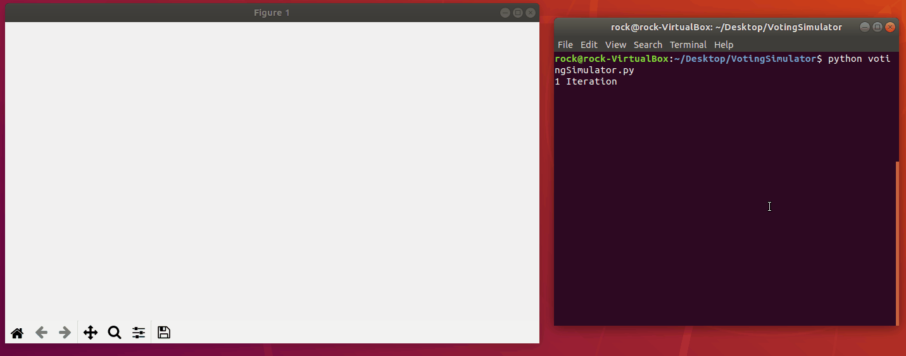

# DAG (Directed Acyclic Graph) Simulator 

This application allows you to simulate an animated DAG while being able to change two properties

1. The amount of votes each node needs before it is "Confirmed" - Votesforconfrimation
2. How many votes each node has - Votespernode

Right now this voting simulator will construct the DAG using a few rules 

1. A vote cannot be cast for the same node more than once 
2. Nodes will always vote for the oldest node first 
3. Nodes will not vote for nodes that has already reached the confirmed votes threshold

This application uses, matplotlib, networkx and graphviz

You can use this application by first running directedgraph.py
You will then want to make any modifications to the votingSimulator.py file, by default Votesforconfrimation and Votespernode are set to 

    votepernode = 2 
    votesforconfrimation = 4 

there is also a default 'Genesis' plot which is added to start the graph, which is set as 

    ("1","2")

directedgraph.py can also interpret any file in the root dir in JSON format where relationships between nodes are specified as a tuple as such 

`("1","2")` - Node 2 Votes for Node 1
